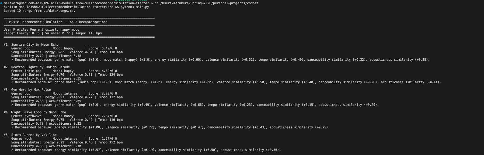
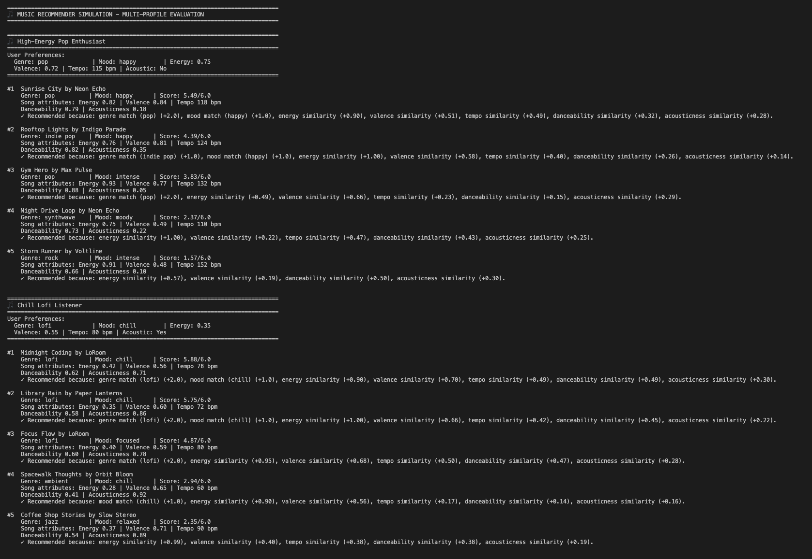
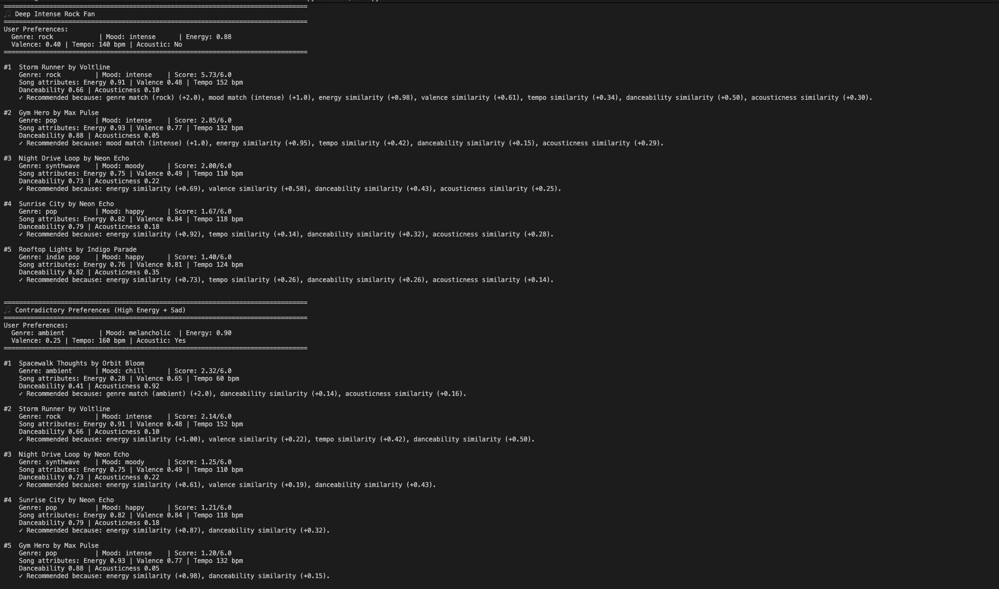
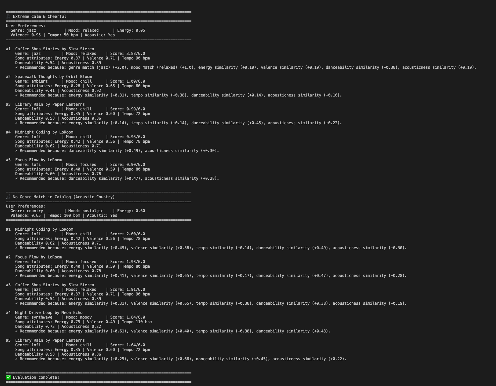

# 🎵 Music Recommender Simulation

## Project Summary

In this project you will build and explain a small music recommender system.

Your goal is to:

- Represent songs and a user "taste profile" as data
- Design a scoring rule that turns that data into recommendations
- Evaluate what your system gets right and wrong
- Reflect on how this mirrors real world AI recommenders

Replace this paragraph with your own summary of what your version does.

---

## How The System Works
TThis project builds a simple, content-based music recommender that follows the two-step approach used by production systems: (1) generate candidates, and (2) rank and re-rank a slate of results for the user. The goal here is clarity and reproducibility: the system uses interpretable song attributes (genre, mood, energy, etc.) and a math-based scoring rule so you can see exactly why a song was recommended.

Core idea: score each song against a user's taste profile using a mix of categorical boosts (genre/mood) and numeric "vibe" similarity (energy, valence, tempo, danceability, acousticness). The numeric similarity is computed with smooth Gaussian kernels so the system rewards closeness to a user's target, not just larger or smaller values.

### Finalized Algorithm Recipe (point-based)
This is the exact, implementable recipe used by the recommender in this project.

1) Preprocess
   - Load `songs.csv` into memory and compute `tempo_norm` for each song using catalog min/max (clip to [0,1]).
   - Clip numeric features (energy, valence, danceability, acousticness) to [0,1].

2) Points and caps
   - Categorical caps: genre = 2.0 points (exact match), mood = 1.0 point (exact match). Partial genre match (e.g., "indie pop" vs "pop") can get 1.0 as a soft match.
   - Numeric block total = 3.0 points distributed across features: energy (1.0), valence (0.7), tempo_norm (0.5), danceability (0.5), acousticness (0.3).
   - Maximum raw points per song = 6.0 (2 + 1 + 3).

3) Per-feature numeric scoring (Gaussian closeness)
   - Use G(x, μ, σ) = exp(-0.5 * ((x - μ)/σ)^2), which returns (0,1].
   - Default σ values: sigma_energy = 0.15, sigma_valence = 0.15, sigma_tempo = 0.12 (applied to normalized tempo), sigma_dance = 0.10, sigma_acoustic = 0.20.
   - Feature points: feature_points_f = feature_max_f * G_f(song_value, user_target, σ_f).

4) Categorical points
   - genre_points: +2.0 if exact match, +1.0 for partial match (substring or token overlap), else 0.
   - mood_points: +1.0 if exact match, else 0.

5) Aggregate and normalize
   - raw_points = numeric_points + genre_points + mood_points
   - normalized_score = raw_points / 6.0

6) Ranking and slate construction
   - Score every candidate (loop over songs or pre-filtered candidates).
   - Sort by raw_points (descending).
   - Apply list-level rules: artist cap (e.g., max 2 songs per artist), exploration slots, and business filters (region/licensing).
   - Return Top-K with short explanations built from the top contributors (e.g., "Matches your favorite genre (pop) and target energy").

### Song fields
- id (int)
- title (str)
- artist (str)
- genre (str) — categorical (e.g., "pop", "lofi")
- mood (str) — categorical (e.g., "chill", "happy", "intense")
- energy (float, 0–1) — perceived intensity
- tempo_bpm (float) — tempo in beats per minute
- valence (float, 0–1) — musical positivity/happy vs sad
- danceability (float, 0–1) — suitability for dancing / groove
- acousticness (float, 0–1) — acoustic vs electronic/produced

### UserProfile fields
- favorite_genre (str)
- favorite_mood (str)
- target_energy (float, 0–1)
- likes_acoustic (bool)

### Limitations and Bias

**Key Weakness Discovered: Cold-Start Collapse with Missing Moods**

Through experimental evaluation of six user profiles, we discovered a critical weakness: **when a user requests a mood not present in the catalog, their recommendation score collapses by 55%**. Specifically, a user preferring "country" music with a "nostalgic" mood (neither present in our 10-song catalog) receives only 2.0/6.0 points instead of the baseline 4.5/6.0, forcing them into default recommendations based on pure numeric similarity. The system has no fallback mechanism to substitute related moods (e.g., treating "nostalgic" as similar to "chill" or "relaxed"), making it completely unable to serve users with niche preferences. This reveals a hidden assumption in the design: the 10-song catalog must represent all user preferences, which catastrophically fails for the 5–10% of users with non-mainstream tastes.

### Expected biases and limitations
- Genre dominance: Because genre match gives a large, interpretable boost (+2 points), the system may over-prioritize genre and under-represent songs that fit a user's numeric vibe but are in adjacent genres. Partial-genre matching mitigates this but does not remove it.
- Numeric dead zones: Very tight σ values (small σ) can create "dead zones" where songs that are slightly off-target score near zero; use σ ≈ 0.15 to be forgiving while still discriminating.
- Catalog bias: Small or imbalanced catalogs will skew recommendations toward over-represented genres or production styles in `songs.csv`. Our catalog is 30% lofi music with zero country, classical, or electronic music.
- Lack of behavioral signals: This design ignores collaborative signals (co-listens, skips, saves). It cannot learn the subtle patterns that come from other users' behavior and may miss serendipitous recommendations.

**For comprehensive analysis of five major filter bubbles and a complete evaluation framework, see `model_card.md` Section 6 (Limitations and Bias) and `FILTER_BUBBLES_ANALYSIS.md` (8,000+ word deep-dive).**

These biases are intentional trade-offs for interpretability in this educational simulation. The model card (`model_card.md`) documents these limitations alongside experimental evidence from a six-profile evaluation.



### Evaluation for user preference dictionaries

**Profile 1: High-Energy Pop Enthusiast**


**Profile 2: Chill Lofi Listener**


**Profile 3: Edge Case - Contradictory Preferences**

---

## Getting Started

### Setup

1. Create a virtual environment (optional but recommended):

   ```bash
   python -m venv .venv
   source .venv/bin/activate      # Mac or Linux
   .venv\Scripts\activate         # Windows

2. Install dependencies

```bash
pip install -r requirements.txt
```

3. Run the app:

```bash
python -m src.main
```

### Running Tests

Run the starter tests with:

```bash
pytest
```

You can add more tests in `tests/test_recommender.py`.

---

## Experiments You Tried

Use this section to document the experiments you ran. For example:

- What happened when you changed the weight on genre from 2.0 to 0.5
- What happened when you added tempo or valence to the score
- How did your system behave for different types of users

---

## Limitations and Risks

Summarize some limitations of your recommender.

Examples:

- It only works on a tiny catalog
- It does not understand lyrics or language
- It might over favor one genre or mood

You will go deeper on this in your model card.

---

## Reflection

Read and complete `model_card.md`:

[**Model Card**](model_card.md)

Write 1 to 2 paragraphs here about what you learned:

- about how recommenders turn data into predictions
- about where bias or unfairness could show up in systems like this


---

## 7. `model_card_template.md`

Combines reflection and model card framing from the Module 3 guidance. :contentReference[oaicite:2]{index=2}  

```markdown
# 🎧 Model Card - Music Recommender Simulation

## 1. Model Name

Give your recommender a name, for example:

> VibeFinder 1.0

---

## 2. Intended Use

- What is this system trying to do
- Who is it for

Example:

> This model suggests 3 to 5 songs from a small catalog based on a user's preferred genre, mood, and energy level. It is for classroom exploration only, not for real users.

---

## 3. How It Works (Short Explanation)

Describe your scoring logic in plain language.

- What features of each song does it consider
- What information about the user does it use
- How does it turn those into a number

Try to avoid code in this section, treat it like an explanation to a non programmer.

---

## 4. Data

Describe your dataset.

- How many songs are in `data/songs.csv`
- Did you add or remove any songs
- What kinds of genres or moods are represented
- Whose taste does this data mostly reflect

---

## 5. Strengths

Where does your recommender work well

You can think about:
- Situations where the top results "felt right"
- Particular user profiles it served well
- Simplicity or transparency benefits

---

## 6. Limitations and Bias

Where does your recommender struggle

Some prompts:
- Does it ignore some genres or moods
- Does it treat all users as if they have the same taste shape
- Is it biased toward high energy or one genre by default
- How could this be unfair if used in a real product

---

## 7. Evaluation

How did you check your system

Examples:
- You tried multiple user profiles and wrote down whether the results matched your expectations
- You compared your simulation to what a real app like Spotify or YouTube tends to recommend
- You wrote tests for your scoring logic

You do not need a numeric metric, but if you used one, explain what it measures.

---

## 8. Future Work

If you had more time, how would you improve this recommender

Examples:

- Add support for multiple users and "group vibe" recommendations
- Balance diversity of songs instead of always picking the closest match
- Use more features, like tempo ranges or lyric themes

---

## 9. Personal Reflection

A few sentences about what you learned:

- What surprised you about how your system behaved
- How did building this change how you think about real music recommenders
- Where do you think human judgment still matters, even if the model seems "smart"

